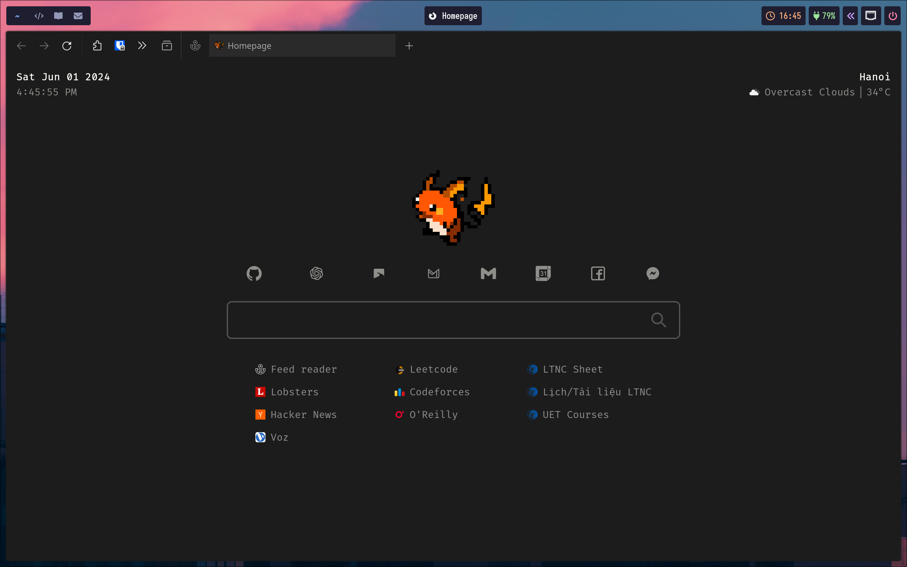
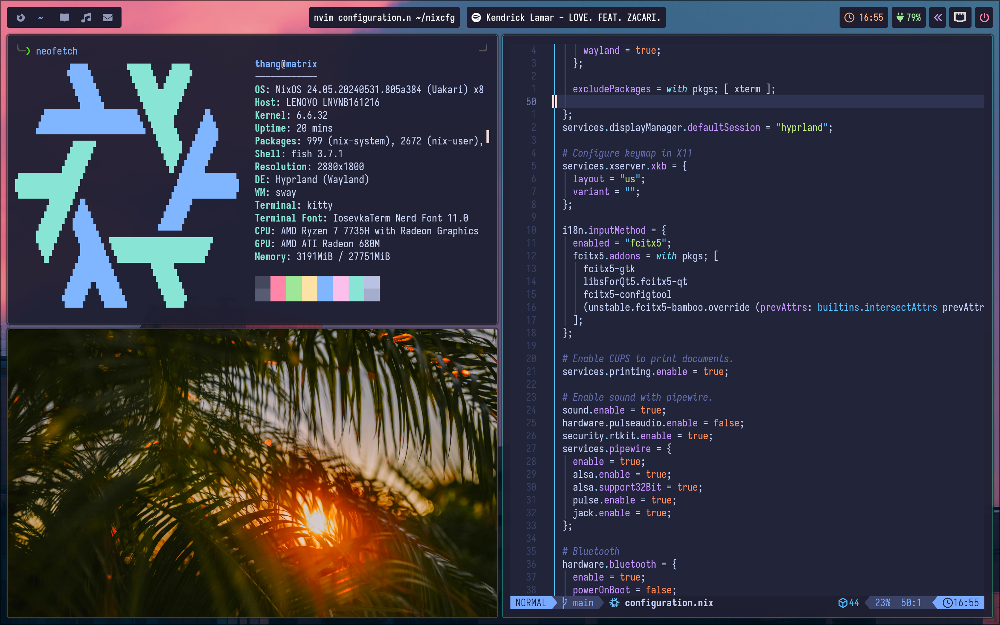
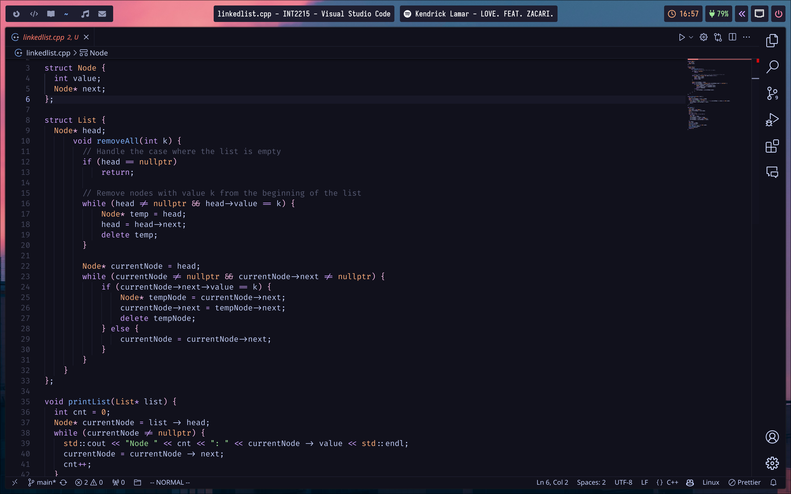
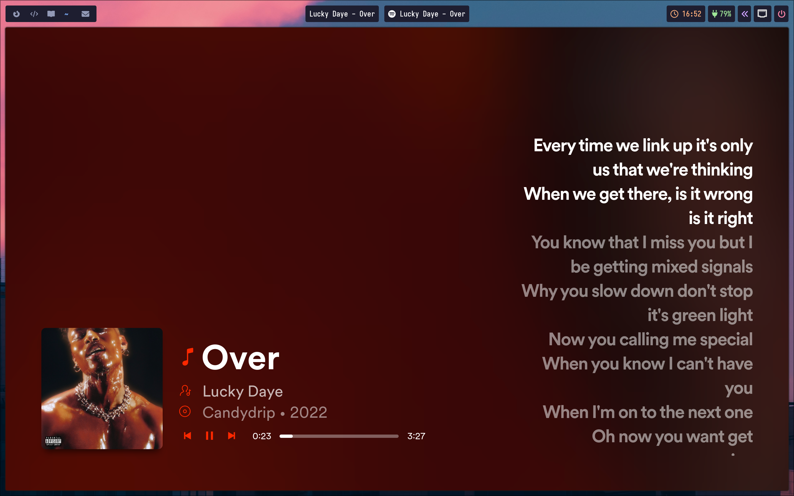

# Simple NixOS configuration

| Component         | Version/Name            |
| ----------------- | ----------------------- |
| Shell             | Fish                    |
| WM (Compositor)   | Hyprland                |
| Bar               | Waybar                  |
| Notification      | Mako                    |
| Launcher          | Rofi-Wayland            |
| Editor            | Nvim + VSCode           |
| Terminal          | Kitty                   |
| OSD               | SwayOSD                 |
| Night Gamma       | HyprShade               |
| Fetch Utility     | Neofetch                |
| Theme             | Catppuccin Mocha    |
| Player            | Spotify                 |
| File Browser      | Thunar                  |
| Internet Browser  | Firefox                 |
| Document reader   | Zathura                 |
| Multimedia player | MPV                     |
| Image viewer      | feh                     |
| Screenshot        | Hyprshot                |
| Color Picker      | Hyprpicker              |
| Clipboard         | Wl-clipboard + Cliphist |
| Idle              | Hypridle                |
| Lock              | Hyprlock                |
| Logout menu       | Wlogout                 |
| Wallpaper         | SWWW                    |
| Display Manager   | SDDM                    |
| Fonts             | IosevkaTerm, Fira Code  |

## Screenshots

